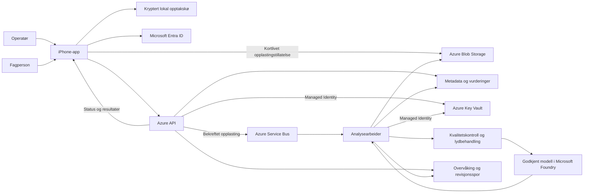

# Designforslag: Akustisk tilstandsovervåking for jernbanen

## Formål og status

Systemet skal legge grunnlaget for prediktivt vedlikehold gjennom standardiserte lydopptak av togpasseringer, sporbar analyse og faglig vurdering. Første versjon er en datainnsamlings- og avvikspilot, ikke et validert system for feilprediksjon, sikkerhetsvurdering eller beregning av gjenværende levetid.

Prosjektet skal designes for et høyt cyberrisikonivå fra starten. Dette er et konservativt designpremiss, ikke en målt risikoscore eller påstand om konkrete sårbarheter. Konfidensialitet, integritet og tilgjengelighet vurderes før funksjoner aktiveres, ikke som et tillegg etter feltpiloten.

Dette er et designforslag. Avgrensningene nedenfor er bekreftet i intervjuet. Den lokale iPhone-prototypen og et separat lokalt backend-grunnlag er implementert etter egne bestillinger. Full iOS-build og fysisk telefonverifikasjon gjenstår. Ingen Azure-backend er deployet, ingen godkjent Foundry-analyse er aktivert, og appen er ikke koblet til backenden.

Første dokumentasjonsleveranse etablerte `plan-predmaint.md` og `.gitignore`. Repoet har nå `front-end/` og `back-end/`, egen app-plan og lokal prototype under `front-end/ios/`. Se [kjøreveiledning og verifikasjonsstatus](front-end/ios/README.md). Azure-/Foundry-integrasjon krever fortsatt en ny bestilling.

### Bestilt første backendetappe

Etter separat bestilling er backend-grunnlaget skrevet som et lokalt Python/uv-API med FastAPI, SQLite, begrenset WAV-opplasting og validering, Entra-autentisering og Key Vault-klient. Se [backendens omfang, kontrakt og sikkerhetsgrenser](back-end/README.md).

Dette er en avgrenset utviklingsetappe med syntetiske data, ikke en autorisert feltpilot eller Azure-deploy. SDK-integrasjon erstatter ikke etablering og verifikasjon av private endepunkter, RBAC og øvrige vault-kontroller. Lokal lagring er ikke produksjonens lagringsmodell. Foundry-analyse er utilgjengelig til modell- og databehandlingsporten er godkjent.

Backendens arbeidsstrømmer deles mellom API/lagring og identitet/vault, med felles integrasjon og verifikasjon før publisering. De tidligere oppgavene om feltgodkjenning og modellvalidering er fortsatt åpne; de er ikke forutsetninger for å teste lokale kontrakter med syntetiske data.

`plan-predmaint.md` i repoet er hoveddokumentet for designet. Videre avklarte planrevisjoner skal gjøres her, få egne beskrivende commits og pushes til samme feature-branch. Sesjonsplaner er bare arbeids-/godkjenningsartefakter. Repoets `origin` er `https://github.com/arrwno/predmaint.git`; planen publiseres ikke direkte til `main`.

Intervjuet bygger på instruksjonene fra Matt Pococks `grill-with-docs`, `grilling` og `domain-modeling`, hentet fra det angitte GitHub-repoet. Disse var ikke tilgjengelige som installerte skills. Instruksjonene er brukt direkte; ingen skill er installert.

## Bekreftet omfang

### Første etappe: lokal læringsapp

Teamet kjenner Azure og backend, men er nybegynnere på iOS. Vi begynner derfor med en [enkel lokal iPhone-app](front-end/plan-iphone.md): start/stopp, opptaksliste og avspilling, uten innlogging, opplasting, Azure eller Foundry. Opptak skjer bare i forgrunnen, med maks 120 sekunder og WAV-format.

Dette er en forberedende læringsetappe, ikke feltpiloten i tabellen nedenfor. Den endrer ikke langsiktige krav om faglig vurdering, offline-opplasting og godkjent modellbehandling.

Frontend-dokumentasjon ligger i `front-end/`, med senere Xcode-prosjekt under `front-end/ios/`. Python/uv-backend får sitt eget område i `back-end/`. Git versjonerer README-filer og planer slik at begge katalogene er synlige uten tomme plassholdere.

### Langsiktig feltpilot

| Tema | Beslutning |
|---|---|
| Komponenter | Mulige akustiske avvik fra hjul og lager på tog |
| Opptakssted | iPhone på fast, sikkert sted ved sporet, etter godkjent feltprosedyre |
| Opptak | Operatør starter og stopper én passering manuelt |
| Identitet | Målested, spor, retning, automatisk tidspunkt og tognummer når kjent |
| Presisjon | Funn knyttes til passeringen; ingen automatisk identifikasjon av aksel eller lager |
| Datagrunnlag | Ingen eksisterende lyddata koblet til bekreftede feil |
| App | Native Swift/SwiftUI med AVFoundation |
| Nett | Offline opptak, kryptert lokal kø og asynkron opplasting |
| Brukere | Én organisasjon, Entra ID, operatør og fagperson |
| Vurdering | I iPhone-appen; ingen egen nettportal eller vedlikeholdsintegrasjon i piloten |
| Backend | Azure, med separat API, lagring, kø og analysearbeider |
| Backend-språk | Python |
| Python-miljø | uv for avhengigheter, låsefil og prosjektlokalt virtuelt miljø |
| Cyberrisiko | Høyrisikopremiss, eksplisitt trusselmodell og sikkerhetsporter |
| Hemmelighetshåndtering | Azure Key Vault i backend og Managed Identity; ingen backendhemmeligheter i appen |
| Modell | Foundry-katalogen kan brukes uavhengig av utgiver, etter egnethetskontroll |
| Geografi | Godkjent EU/EØS-behandling; ingen global modellruting |
| Oppbevaring | Forslag om 90 dager for rålyd, med særskilt godkjenning for datasett |
| Pilotlast | Inntil 10 brukere, 3 målesteder og 200 opptak per dag |
| Opptaksgrense | Maksimalt 120 sekunder; avkorting merkes tydelig |
| Servicemål | 95 % av gyldige, ferdig opplastede opptak får resultat eller tydelig feilstatus innen 5 minutter ved pilotlast |
| Ansvar | Ingen automatiske operative tiltak eller erklæring om at tog er trygge |

Servicemålet omfatter også feilstatus, og må derfor rapporteres sammen med andel vellykkede analyser. Et system som raskt feiler på alle opptak har ikke en vellykket pilot. Det er ingen sanntidsgaranti.

Utenfor omfang: ubemannet kontinuerlig lytting, Android, sporfeil og sporveksler, automatisk komponentlokalisering, integrasjon med trafikk-/vedlikeholdssystemer, flerorganisasjonsplattform og produksjonsvalidert feilprediksjon.

## Arkitektur

Foreslått enkel Azure-realisering:

- Azure Container Apps for API og separat analysearbeider. Arbeideren kan skaleres på kølast; AKS og agentorkestrering er ikke nødvendig for piloten.
- Privat Blob Storage for originalopptak og avledede analyseklipp.
- Service Bus for jobber, kontrollert retry og dead-letter-kø.
- Azure SQL Database for relasjoner, status, analyseversjoner og faglige vurderinger.
- Microsoft Foundry for den evaluerte modellens endepunkt.
- Azure Key Vault som obligatorisk sikkerhetskomponent i backendmiljøene. Managed Identity foretrekkes fremfor tjenestenøkler; nødvendige hemmeligheter og sertifikater forvaltes i vaulten.
- Azure Monitor/Application Insights for tekniske målinger og alarmer. Ikke logg rålyd, tilgangstokener eller kortlivede lagringslenker.

Backend bygges i Python. API og arbeider kan starte i samme kodebase, men kjøres som separate prosesser. uv brukes til å administrere Python-versjon, prosjektlokalt virtuelt miljø og avhengigheter.

### Python og uv ved senere implementering

Prosjektet definerer støttet Python-versjon og direkte avhengigheter i `pyproject.toml`. `uv.lock` versjoneres for reproducerbare installasjoner, og `.python-version` versjoneres hvis den brukes til å feste tolkeversjonen. `.venv/` er lokalt og skal aldri versjoneres.

Bruk `uv sync --locked` for å opprette/synkronisere miljøet fra låsefilen, og `uv run` for tester og utviklingskommandoer. CI og containerbygg bruker samme låsefil; produksjonsmiljøet installerer ikke utviklingsavhengigheter. Testvalg og avhengigheter fastsettes når implementeringen bestilles, ikke gjennom ubegrunnet installasjon nå.

## Git, .gitignore og publisering

Hovedplan, frontend-plan, kildekode og README-filer versjoneres med Git. De lokale app-/backendgrunnlagene er implementert; Azure-feltpiloten er ikke det. Lyddata, personlige Xcode-filer og byggeartefakter holdes utenfor Git.

### Sporbar planutvikling

Første commit registrerer den samlede planen slik den er avklart til nå. Tidligere intervjuendringer finnes i samtalen, men skal ikke presenteres som eksisterende Git-historikk eller rekonstrueres som tilbakedaterte commits.

Etter publisering oppdateres `plan-predmaint.md` ved hver avklart planrevisjon. Hver sammenhengende revisjon får en egen commit med en kort beskrivelse av hvilke krav eller beslutninger som er endret, og pushes til samme feature-branch. Ikke amend, squash eller skriv om planhistorikken uten eksplisitt ønske.

Git-historikken er endringsloggen; en separat manuelt vedlikeholdt changelog er ikke nødvendig. `git log --follow -- plan-predmaint.md` viser revisjonene, og `git diff <før> <etter> -- plan-predmaint.md` viser innholdsendringene. Når repoet er tilgjengelig på GitHub, kan filhistorikken brukes der.

Fremtidige sesjoner skal lese prosjektfilen og dens Git-historikk før nye revisjoner, slik at bare en lokal sesjonsplan ikke blir en konkurrerende kilde. Hvis planmodus blokkerer en repoendring, må endringen godkjennes før publisering; ikke hevde at den er Git-lagret før commit og push er verifisert.

`.gitignore` dekker prosjektlokale virtuelle miljøer, Python-bytecode, test-/lintcache, dekningsrapporter, byggeartefakter, lokale IDE-/macOS-filer, `.env`-filer og lokale logger. `/local-data/`, `/recordings/` og `/datasets/` reserveres for lokale data og ignoreres. Ikke bruk et bredt mønster som skjuler alle lydfiler; syntetiske, eksplisitt godkjente testfiler kan senere versjoneres.

`.env.example` kan versjoneres med ufølsomme plassholdere, aldri virkelige nøkler. `uv.lock`, `pyproject.toml`, eventuell `.python-version`, kildekode og dokumentasjon skal ikke ignoreres. En `.gitignore` er ikke en sikkerhetsgrense og fjerner ikke data som allerede er sporet av Git.

Før commit kontrolleres status og diff for utilsiktede filer, personopplysninger og hemmeligheter. Stage bare bestilte filer med eksplisitte filnavn. Commit inkluderer påkrevd Copilot-medforfattertrailer. Push skjer til sesjonens eksisterende feature-branch på `origin`; branchnavn leses fra Git ved utførelse. Ingen force-push, branch-endring, push til `main` eller automatisk PR-opprettelse.

Etter push verifiseres at fjernbranchens commit-ID samsvarer med den lokale committen. Ved avvist push, manglende tilgang eller nettfeil rapporteres blokkeringen uten å hevde at publisering lyktes. Ikke endre GitHub- eller branch-beskyttelse for å omgå feil.

## App og operatørflyt

1. Operatøren logger inn på nett og velger et forhåndsdefinert målested, spor og retning. Tidligere godkjente innloggingsøkter kan tillate lokale opptak uten nett; servertilgang krever gyldig autentisering.
2. Appen viser feltprosedyren og mikrofontillatelsen. Appen gir ingen tillatelse til å oppholde seg ved sporet; eksisterende sikkerhetsregler gjelder.
3. Operatøren registrerer tognummer når kjent og starter opptaket. Appen viser varighet, lydnivå og eventuell klipping.
4. Appen stopper ved operatørhandling eller 120-sekundersgrensen. Avbrudd, telefonsamtaler, ruteendringer for mikrofon og automatisk stopp registreres; ufullstendige opptak merkes.
5. Lydfil og metadata lagres atomisk lokalt. Operatøren ser «lagret på telefonen», ikke «sendt», før serveren har bekreftet mottak.
6. En filbasert bakgrunnsopplasting forsøkes når nett og iOS tillater det. Gjenopptakelse og ny innlogging håndteres uten å miste opptaket. Bakgrunnskjøring er ikke garantert, særlig etter tvangsavslutning.
7. Appen viser opplastingsstatus og senere analyse/status ved oppdatering. Pushvarsling kan vurderes senere; er ikke en forutsetning.

Foreslått opptaksformat er ukomprimert PCM i WAV, mono, 48 kHz og 16 bit. Det gir omtrent 11,52 MB lyddata for 120 sekunder. Faktisk samplingsfrekvens, mikrofonrute, telefonmodell og appversjon registreres; ingen påstand om kalibrert lydtrykk.

Originalen bevares uendret. Resampling og segmentering skjer i backend i henhold til valgt modells krav. Bluetooth-/headsetmikrofon og talebehandlingsmodi må kontrolleres; ukjente opptakskjeder skal merkes, ikke behandles som sammenlignbare.

Kryptert lokal lagring bruker iOS Data Protection og Keychain. Valgt beskyttelsesklasse må støtte godkjent bakgrunnsopplasting uten å åpne mer tilgang enn nødvendig. Køen har en eksplisitt lagringsgrense som fastsettes ved implementering; full disk gir synlig feil, aldri stille sletting av usendte opptak. Lokal lyd slettes etter bekreftet mottak og en vedtatt lokal oppbevaringspolicy.

## Opptaksprosedyre og datakvalitet

Bruk samme plassering, orientering og opptaksoppsett ved hvert målested. Avstand og annen plassering beskrives i stedets godkjente prosedyre. Noter vind, nedbør, mulig interferens fra andre tog og hastighet når den er kjent, med kilde og usikkerhet; ikke finn på manglende målinger.

Backend validerer filtype ved dekoding, varighet, faktisk samplingsformat, størrelse, sjekksum og metadata. Kvalitetskontrollen måler blant annet stillhet, klipping og forstyrrelser. Terskler for brukbare opptak må bestemmes fra pilotdata og faglig vurdering, ikke generiske antakelser.

Utilstrekkelig kvalitet gir «kan ikke vurderes» med årsak. Manglende tognummer tillates. Flere samtidige passeringer eller uklar identitet merkes; ingen automatisk kobling til en bestemt komponent.

## Analyse og Foundry-beslutningsport

Støtte for lydinput er ikke det samme som dokumentert evne til å oppdage jernbanefeil. Talegjenkjenning alene er ikke en erstatning for analyse av mekanisk lyd.

Microsofts dokumentasjon beskriver lydinput i Chat Completions for blant annet `gpt-4o-audio-preview` og `gpt-4o-mini-audio-preview`. Disse er kandidater for teknisk utprøving, ikke valgte eller validerte feilmodeller. Preview-status, livssyklus og godkjent bruk må vurderes.

Før modellen aktiveres i feltpiloten må følgende kontrolleres:

- Faktisk tilgjengelig modellversjon, støtte for direkte lydinput, filformat, klipplengde, kvote og pris.
- Endepunktets behandling og lagring i godkjent EU/EØS-område, inkludert leverandørvilkår og eventuell abuse monitoring. En ressurs i Europa beviser ikke alene europeisk modellbehandling.
- Egnethet på representative togopptak, dårlige opptak og opptak uten tog, vurdert mot uavhengige faglige beskrivelser.
- At svar kan valideres, uttrykke usikkerhet og avstå fra vurdering uten å finne på komponentidentitet, diagnose eller sikkerhetskonklusjon.

Hvis ingen kandidat oppfyller kravene, forblir automatisk modellanalyse deaktivert. Opptak og faglig vurdering fortsetter, med synlig status «modellanalyse ikke tilgjengelig». Systemet skal ikke stille bytte til taleanalyse, en modell uten godkjenning eller global ruting.

Arbeideren utfører kvalitetskontroll, versjonert lydbehandling og modellkall. Ved behov deles klippet i segmenter med bevart tidsreferanse. Segmentering, modellversjon, instruksjonsversjon og analyseparametre lagres. Modellens filgrense og transportoverhead kontrolleres separat fra appens opptaksgrense.

### Foreslått analysekontrakt

| Felt | Innhold |
|---|---|
| `analysisId`, `recordingId` | Sporbare identifikatorer |
| `status` | `completed`, `not_assessable`, `failed` eller `unavailable` |
| `quality` | Kvalitetsmålinger, merknader og vurderbarhet |
| `observations` | Tidsintervall, nøktern lydbeskrivelse og begrensninger |
| `summary` | Kort norsk beskrivelse, eksplisitt foreløpig |
| `provenance` | Modell, deployment, versjon, instruksjon og forbehandling |
| `error` | Maskinlesbar feilkode og trygg brukermelding når relevant |

Avvik er observasjoner som krever faglig vurdering, ikke bekreftede feil. Tidsangivelser fra generative modeller er hypoteser og må verifiseres. Modellens egen oppgitte «confidence» er ikke en kalibrert feilsannsynlighet og vises ikke som dette.

«Ingen avvik observert» må alltid ledsages av at analysen ikke utelukker feil. Strukturert svar valideres server-side; støtte for schema-basert generering må kontrolleres for modellen. Ugyldig svar gir eksplisitt analysefeil. Tale og tekst i opptak behandles som data, aldri instruksjoner til systemet. Modellen får ingen operative verktøy.

## Fagpersonens arbeidsflyt

Fagpersonen ser passering, opptakskvalitet, lyd og foreløpige observasjoner. Første vurdering bør kunne registreres før modellforslaget vises, for å redusere bekreftelsesbias i evalueringsdata.

Vurderingsutfall er «bekreftet funn», «avkreftet mistanke», «behov for inspeksjon» eller «kan ikke vurderes». «Bekreftet» krever dokumentert grunnlag, for eksempel inspeksjon; en akustisk mistanke alene er ikke bekreftelse.

Fagpersonen kan registrere komponent, inspeksjonsdato, referanse, faktisk funn og vedlikehold når tilgjengelig. Koblingen til tog/komponent må ha en dokumentert identitetskilde. Modellresultat og faglig vurdering lagres separat; rettelser får historikk.

Eventuell sikkerhetskritisk mistanke håndteres gjennom organisasjonens eksisterende operative prosedyrer. Appen erstatter ikke slike kanaler.

## Domene og datamodell

### Begreper

**Målested:** Et definert sted hvor togpasseringer observeres etter en fast måleprosedyre.

**Passering:** En observert togbevegelse forbi et målested, med eventuell kjent togidentitet.

**Opptak:** Lyd og registrert kontekst som dokumenterer hele eller deler av en passering.

**Akustisk avvik:** En lydobservasjon som skiller seg fra forventet mønster; ikke i seg selv en diagnose.

**Analyse:** En avgrenset undersøkelse av et opptak med dokumenterte observasjoner og begrensninger.

**Faglig vurdering:** En fagpersons vurdering av observasjoner og behovet for videre undersøkelser.

**Bekreftet funn:** En tilstand med dokumentert faglig grunnlag, ikke bare modellens antakelse.

**Prediksjon:** En vurdering av en framtidig tilstand basert på historikk og validerte sammenhenger; utenfor første pilot.

### Entiteter

| Entitet | Sentrale felt og relasjoner |
|---|---|
| Målested | ID, spor, beskrivelse, godkjent opptaksprosedyre og prosedyreversjon |
| Passering | ID, målested, retning, observasjonstid, valgfri togidentitet og identitetskilde |
| Opptak | Klientgenerert UUID, passering, bruker, opptaksformat, varighet, sjekksum, objektpeker, kvalitet og oppbevaringsfrist |
| Analyse | Opptak, kjørings-ID, status, observasjoner, versjoner og feil |
| Faglig vurdering | Opptak/analyse, fagperson, utfall, begrunnelse og revisjon |
| Bekreftet funn | Passering/vurdering, dokumentasjonsreferanse, kjent komponent og eventuell vedlikeholdsreferanse |
| Datasettgodkjenning | Opptak, formål, beslutning, ansvarlig og egen oppbevaringsfrist |
| Revisjonshendelse | Aktør, handling, berørt objekt og tidspunkt |

En passering kan ha flere opptak; et opptak kan ha flere analyseversjoner og faglige vurderinger. Ukjent identitet er eksplisitt, ikke en oppdiktet tog-ID. En ny analyse overskriver ikke historikken.

## API og robust jobbflyt

Foreslåtte endepunkter:

- `GET /v1/sites`: godkjente målesteder og prosedyrer.
- `POST /v1/recordings`: registrer metadata idempotent med klient-ID; returner opptaks-ID og kortlivet opplastingstillatelse til ett bestemt objekt.
- `POST /v1/recordings/{id}/complete`: verifiser mottatt objekt og bekreft mottak; planlegg analyse.
- `GET /v1/recordings` og `GET /v1/recordings/{id}`: paginert oversikt, status og resultater innenfor brukerens tilgang.
- `GET /v1/recordings/{id}/audio-access`: kortlivet lesetilgang for autorisert vurdering.
- `POST /v1/recordings/{id}/reviews`: registrer versjonert faglig vurdering.
- `DELETE /v1/recordings/{id}`: autorisert slettingsforespørsel med sporbar status.

Appen får aldri Foundry-nøkler. Opplastingstillatelser gir ingen liste-/lesetilgang og bare nødvendig skrivetilgang til objektet. Serveren verifiserer faktisk innhold og håndhever størrelsesgrenser; tillatelsen alene garanterer ikke filstørrelse.

Serverstatus går fra registrert til mottatt, kølagt, under analyse og en eksplisitt terminalstatus. Lokal opptaks-/opplastingsstatus holdes separat fra serverens analysestatus.

Metadataoppdatering og jobbbestilling kobles med en transactional outbox. Dette lukker feilen der databaseoppdateringen lykkes, men køpublisering feiler. Service Bus leverer minst én gang; arbeideren må derfor være idempotent på opptak og analyseversjon. Duplikater skal ikke gi doble vurderingsgrunnlag.

Midlertidige feil får begrenset retry med backoff; permanente feil går direkte til feilstatus. Dead-letter-jobber vises og varsles til drift. En overvåker finner jobber som står fast, og publiserer synlig status dersom fristen overskrides. Reanalyse er en eksplisitt handling med ny kjørings-ID.

## Sikkerhet, personvern og sletting

Entra ID begrenses til organisasjonens tenant. Backend håndhever operatør-/fagperson-/administrativ tilgang for hver handling og hvert objekt; UI-begrensninger er ikke adgangskontroll.

### Konkrete cybersikkerhetskrav

Prosjektets trusselmodell beskriver verdier, aktører, angrepsflater og tillitsgrenser for hver etappe. Telefon og opplastet innhold behandles som upålitelig fra backendens perspektiv. Registrer konsekvens, sannsynlighet, tiltak, risikoeier og restrisiko; faglig godkjenning av restrisiko kreves før feltbruk.

| Risikoscenario | Krav fra starten |
|---|---|
| Mistet telefon og lekkede opptak | Enhetskode, Data Protection, minst mulig data, kontrollert backup og oppbevaring |
| Stjålet konto eller tilgang til andres opptak | MFA, tenant-/tokenvalidering, minste privilegium og objektbaserte tilgangstester |
| Falske opptak, replay eller feil togkobling | Validering, idempotens, kilde-/identitetssporbarhet og historikk |
| Ondsinnet lyd eller ressursmisbruk | Isolert dekoding, størrelses-/tids-/ressursgrenser og kostnadsgrenser |
| Lekkede hemmeligheter | Key Vault, separate identiteter, rotasjon, tilgangslogger og tilbakekalling |
| Upålitelig modellrespons | Validert output, menneskelig vurdering og ingen operative modellverktøy |
| Kompromittert repo eller byggkjede | Review, beskyttet hovedbranch, skanning og federert CI-identitet |
| Driftsstans, sletting eller tilgangstap | Overvåking, hendelsesansvar, gjenoppretting og synlige feiltilstander |

En sjekksum kontrollerer innholdsintegritet, men beviser ikke at lyd, tidspunkt eller togidentitet er autentisk. Modellresultater er ikke sikkerhetsbevis. Ingen kobling til togstyring inngår.

- API-et validerer Entra-tokenets signatur, utsteder, tenant, audience, gyldighet og roller med vedlikeholdte biblioteker. Bruk minste privilegium for mennesker og tjenesteidentiteter; MFA og enhetspolicy håndheves gjennom organisasjonens Entra-policy.
- All ekstern kommunikasjon bruker TLS. Lagring er kryptert; produksjons- og utviklingsdata holdes adskilt. Lagring, database og modellendepunkt får private nettverksforbindelser der tjenestene støtter det. Mobil opplasting må ha en eksplisitt godkjent inngang: kortlivet, avgrenset SAS til offentlig tilgjengelig lagringsendepunkt med anonym tilgang deaktivert, eller opplasting via API. Ikke lov direkte mobilopplasting til et rent privat endepunkt.
- Begrens requeststørrelse, opplastingsvolum, samtidighet og kallrate. Kontroller filen ved dekoding, ikke bare filnavn eller MIME-type. Lyddekoding skjer med CPU-/minne-/tidsgrenser og vedlikeholdte biblioteker. Ikke bruk brukerinput til shellkommandoer eller filbaner.
- Bruk parameteriserte databasespørringer, validerte kontrakter og objektbasert autorisasjon for å forebygge injeksjon og uautorisert datatilgang. Bruk UUID-er som identifikatorer, men aldri som erstatning for adgangskontroll.
- Hemmeligheter håndteres etter Key Vault-kravene nedenfor, aldri i kildekode, Git, app eller logger. En ignorert `.env` erstatter ikke vaulten; lekkede hemmeligheter tilbakekalles.
- Containerne kjører som ikke-root med minst mulig image og rettigheter. Avhengigheter låses med uv, sikkerhetsoppdateringer vurderes løpende, og CI får avhengighets-/hemmelighetsskanning før produksjonsbruk.
- CI/CD bruker kortlivet federert identitet fremfor langsiktige Azure-nøkler. Beskyttelse av hovedbranch og krav om review/statuskontroller anbefales, men endring av repoets innstillinger inngår ikke i denne dokumentasjonsleveransen.
- Logg tilgangsendringer, analysefeil og administrative handlinger uten rålyd eller sensitive tilgangsdata. Definer alarmer, ansvar for hendelser og håndtering av sikkerhetsbrudd. Restore-prosedyre prøves mot godkjente backup- og slettefrister.
- Modellinput regnes som upålitelig innhold. Modellen har ingen verktøy eller rettighet til å ta operative beslutninger; output valideres før lagring og visning.

Dette er designkrav og anbefalinger, ikke en gjennomført sikkerhetsrevisjon eller påstand om at en implementering er sikker.

### Azure Key Vault og identiteter

Azure Key Vault etableres med backenden, før reelle tjenestehemmeligheter brukes. Opprett separate vaults for utvikling/test og produksjon i godkjente regioner. Produksjonshemmeligheter skal aldri kopieres til utviklingsmiljøet. Vaulten lagrer nødvendige hemmeligheter og sertifikater, ikke lyd eller treningsdata.

- Bruk Azure RBAC og dedikerte Managed Identities for API og analysearbeider. Gi bare nødvendig lesetilgang til aktuelle hemmeligheter. Kjørende tjenester får ingen rett til å opprette, slette eller administrere vaulten. Administrativ tilgang bruker MFA og tidsbegrenset privilegert tilgang.
- Bruk Private Endpoint med privat DNS og deaktiver offentlig nettverkstilgang til vaulten. CI og administratorer må ha godkjente nettverksveier; ikke åpne vaulten for alle for å få bygg eller drift til å fungere.
- Aktiver soft delete, purge protection og diagnostikk. Varsle om uventet tilgang, gjentatte avslag, rettighetsendringer og slettingsforsøk. Logg aldri hemmelighetsverdier.
- Foretrekk identitetsbasert autentisering til Foundry, lagring, kø og database der støttet. Ikke opprett unødvendige nøkler bare fordi en vault finnes. Nødvendige nøkler og private sertifikater får eier, rotasjonsfrist og tilbakekallingsprosedyre.
- Python-backend bruker Azure SDK og eksplisitt Managed Identity i Azure. Lokal utvikling bruker godkjent utvikleridentitet og kun utviklingsvault; ingen automatisk fallback til delte produksjonsnøkler. Tester bruker syntetiske verdier.
- Ikke bygg hemmeligheter inn i images, Git, CI-artefakter eller appkonfigurasjon. Eventuell minnecache har definert levetid og støtte for rotasjon. Tilgangstap eller utilgjengelig vault gir synlig feil for hemmelighetsavhengig arbeid, aldri hardkodet fallback eller svakere autentisering.

iPhone-appen har ingen direkte tilgang til Key Vault eller backendens nøkler. Ved senere innlogging brukes standard mobilinnlogging med PKCE uten klienthemmelighet; autentiseringstokener håndteres i iOS Keychain. Offline-opptak fungerer uavhengig av vaulten.

Kundeadministrerte krypteringsnøkler vurderes separat ut fra krav og tjenestestøtte. De innføres ikke automatisk: eierskap, rotasjon og gjenoppretting må være avklart, fordi tap av nøkler kan gjøre data utilgjengelige.

### Sikkerhetsporter før videreføring

Før læringsappen bruker reelle opptak, verifiseres filbeskyttelse for lyd og metadata, backup-ekskludering, låsing/bakgrunn, tillatelser og fravær av sensitive logger. Bruk kontrollerte, ufølsomme testopptak til kontrollene er gjennomført.

Før backend integreres, kontrolleres infrastruktur som kode og policy for vault, nettverk og RBAC. Test at riktig identitet får nødvendig tilgang, at feil identitet og offentlig nettverk nektes, og at rotasjon, tilgangstap og gjenoppretting håndteres uten lekkasje.

Før feltpilot kreves dokumenterte tilgangstester, fil-/ressursgrenser, replay-/duplikathåndtering, skanning, alarmer, hendelsesrutiner og restore-prøve, samt uavhengig sikkerhetsgjennomgang. Uavklarte høye/kritiske risikoer krever tiltak eller eksplisitt godkjent restrisiko. Lovlig databehandling og godkjent modellregion er egne porter.

### Personvern og sletting

Lyd kan inneholde tale og andre personopplysninger. Før feltpilot må behandlingsansvarlig godkjenne formål, lovlig grunnlag, informasjon, databehandlerforhold og behov for personvernkonsekvensvurdering. EU/EØS-lokasjon alene er ikke GDPR-godkjenning.

90 dager for rålyd er et bekreftet policyforslag, ikke en endelig juridisk vurdering. Metadata, vurderinger og revisjonsspor trenger egne godkjente frister. Utvalgte opptak kan ikke holdes tilbake som treningsdata uten særskilt dokumentert godkjenning.

Sletting omfatter original, avledede klipp, datasettkopier og identifiserbare analyser etter gjeldende policy. Slettemarkering blokkerer nye modellkall og sene jobbresultater; kømeldinger inneholder bare objekt-ID-er. Backup- og soft-delete-frister dokumenteres, slik at fysisk sletting ikke loves tidligere enn den faktisk skjer.

En app som har vært offline kan ikke garanteres fjernslettet umiddelbart; lokale frister og organisasjonens enhetsstyring må håndtere dette. Lagringslenker er kortlivede, og lyd deles ikke via offentlige URL-er.

## Kapasitet og kostnadsdrivere

Ved 200 maksimale opptak per dag gir foreslått PCM-format omtrent 2,30 GB rålyd per dag og 207 GB over 90 dager, før replikaer, backup, avledede klipp og datasettkopier.

Månedskostnad estimeres etter valgt region og modell:

`lagring + lagringstransaksjoner + nettverk/private endepunkter + API/arbeider + database + kø + Key Vault + overvåking/sikkerhetskontroller + modellforbruk`

Modellforbruk beregnes fra faktisk antall klipp/segmenter og modellens faktureringsenhet. Retry og reanalyse er med i regnestykket. Maksimal samtidighet, kvoter, kostnadsvarsler og en administrativ stopp for modellkjøring skal hindre ukontrollert forbruk. Ingen kostnadsbeløp oppgis før priser og forbruk er verifisert.

## Evaluering og vei til prediktivt vedlikehold

Piloten må dokumentere opptakskvalitet, leveringspålitelighet, behandlingstid, modellens vurderbarhet, faglig samsvar, sporbarhet og datasettkvalitet. «Avkreftet» betyr ikke nødvendigvis at komponenten er frisk dersom inspeksjonsgrunnlaget er utilstrekkelig.

Testscenarioene omfatter nettbrudd, omstart, tvangsavsluttet app, utløpt token, full disk, avbrutt opptak, duplikatopplasting, korrupt fil, køduplikat, Foundry-timeout, ugyldig svar, manglende godkjent modell, rettighetsbrudd og sletting under analyse.

Ytelsesmålet testes under avtalt pilotlast. Faglig evalueringsrapport viser andelen vellykkede, usikre, ubrukelige og feilende analyser separat. Nøyaktighet for feilprediksjon loves ikke uten representative bekreftede utfall.

Videreføring krever data koblet til inspeksjoner og vedlikehold, også normale tilfeller og feil som modellen overså. Evaluering splittes etter tog, sted og tid, slik at klipp fra samme passering ikke lekker mellom trening og test. Ved utilstrekkelig diagnosegrunnlag rapporteres begrensningen.

Reell trendanalyse for et lager krever stabil komponentidentitet og gjentatte observasjoner. Det forutsetter senere identitetskilder eller sensorer og kan ikke utledes fra denne pilotens passeringer alene.

## Todos for eventuell videreføring

1. Git-versjonere designgrunnlaget: opprette `plan-predmaint.md` og `.gitignore` i prosjektroten, kontrollere diff, committe kun disse og pushe til eksisterende feature-branch på `origin`. Verifisere fjerncommit. Bruke prosjektfilen som hoveddokument og committe/pushe hver videre planrevisjon separat. Ingen app/backend uten ny bestilling.
2. Verifisere modell og databehandling: kandidat, endpoint, format, region, vilkår, kvote, pris og representative lydtester.
3. Godkjenne felt- og personvernrammer: opptaksprosedyre, sikkerhet, tilgang, lagringsfrister og datasettformål.
4. Fastsette pilotkontrakter og trusselmodell: lydformat, kvalitetsgrenser, API, statuser, datastruktur, risikoeiere og sikkerhets-/evalueringsporter.
5. Bygge en avgrenset vertikal prototype hvis bestilt: Python/uv, Key Vault og Managed Identity fra første backendetappe, Swift-app, offline-kø, opplasting, analyse og faglig vurdering.
6. Evaluere piloten og beslutte videreføring: robusthet, kostnad, faglig samsvar og grunnlag for spesialisert modell.

Todo 2 og 3 er uavhengige. Todo 4 bygger på 2 og 3. Todo 5 bygger på 4 og en eksplisitt implementeringsbestilling. Todo 6 bygger på 5. Publisering av designet trenger ikke vente på at beslutningsportene er løst; de skal stå som åpne.

## Kilder og uavklarte beslutningsporter

- [Matt Pocock: grill-with-docs](https://github.com/mattpocock/skills/tree/main/skills/engineering/grill-with-docs)
- [Microsoft Foundry Models overview](https://learn.microsoft.com/en-us/azure/foundry/concepts/foundry-models-overview): katalog, modellvalg og ansvar for egnethet.
- [Audio Completions quickstart](https://learn.microsoft.com/en-us/azure/foundry/openai/audio-completions-quickstart): dokumentert lydinput og modellkandidater; siden oppgir 20 MB filgrense for de beskrevne modellene, som må sjekkes mot valgt endpoint.
- [Region availability](https://learn.microsoft.com/en-us/azure/foundry/foundry-models/concepts/models-sold-directly-by-azure-region-availability): kontroller faktisk modell/deployment før valg.

Åpne porter: konkret modell/deployment og godkjent behandlingsgeografi; representative opptak og kvalitetsgrenser; feltgodkjenning og juridiske rammer; endelige frister for lokal lagring og metadata; faktisk budsjett. Dette er forhold som må undersøkes eller godkjennes før feltbruk, ikke skjulte forutsetninger for forslaget.
